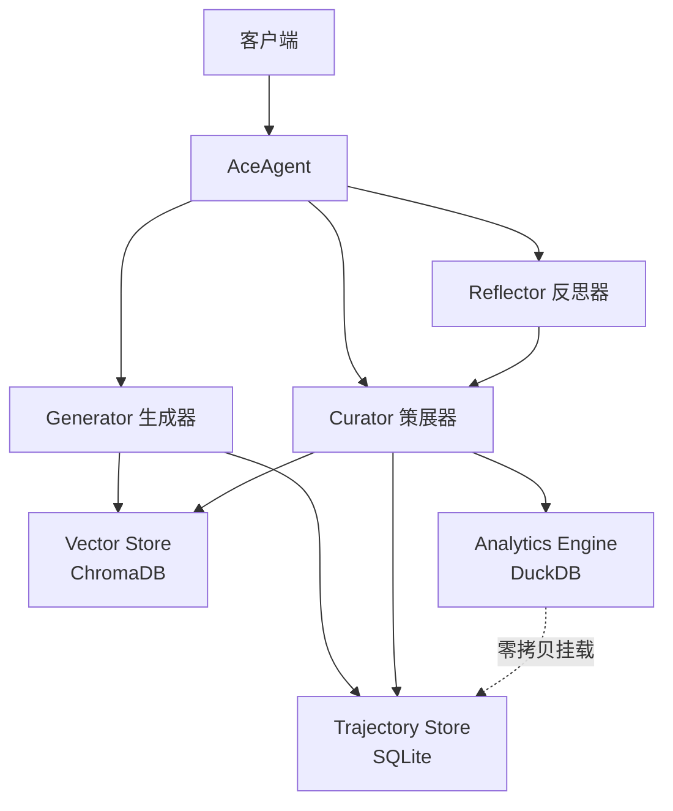

# ACE Engine Core

[](https://www.typescriptlang.org/)
[](https://nodejs.org/)
[](./LICENSE)

**ACE (Agentic Context Engineering) Engine Core** 是一个高性能的自进化智能体框架，基于 Node.js 构建。

## 🌟 核心特性

- **自进化能力**: Agent 通过 Generator-Reflector-Curator 三层架构自动学习和改进
- **高性能读写分离**: 快路径（Hot Path）毫秒级响应，慢路径（Cold Path）后台异步进化
- **零拷贝分析**: DuckDB 直接挂载 SQLite 数据库进行 OLAP 分析
- **模块化设计**: 核心逻辑与存储层解耦，支持自定义适配器
- **类型安全**: 使用 Zod 进行 LLM 输出验证，确保运行时安全

## 🏗️ 系统架构



## 📦 技术栈

- **Runtime**: Node.js 18+ (TypeScript)
- **Vector Store**: ChromaDB (向量记忆)
- **Transaction Store**: SQLite (事务日志，WAL 模式)
- **Analytics Engine**: DuckDB (零拷贝分析)
- **Validation**: Zod (运行时类型校验)

## 🚀 快速开始

### 安装

```bash
npm install ace-engine-core
```

### 基础使用

```typescript
import { ChromaClient } from 'chromadb';
import { AceAgent, ChromaAdapter, SQLiteAdapter, DuckDBAdapter } from 'ace-engine-core';

// 1. 初始化存储
const sqliteStore = new SQLiteAdapter('./data/ace_events.db');
sqliteStore.init();

const chromaClient = new ChromaClient();
const chromaStore = new ChromaAdapter(chromaClient);
await chromaStore.init();

const duckdbAnalysis = new DuckDBAdapter();
await duckdbAnalysis.connect(sqliteStore.getDbPath());

// 2. 创建 Agent
const agent = new AceAgent({
  llm: yourLLMInstance, // 实现 BaseLLM 接口
  vectorStore: chromaStore,
  trajectoryStore: sqliteStore,
  analysisEngine: duckdbAnalysis,
  reflectionStrategy: 'always', // 'always' | 'on_failure' | 'sampling'
});

// 3. 监听事件
agent.on('evolved', (deltas) => {
  console.log('Agent 进化了！更新:', deltas);
});

// 4. 执行任务
const result = await agent.run('帮我写一个 Python 脚本');
console.log(result);

// 5. 关闭资源
await agent.close();
```

## 🔧 配置选项

### AceAgentConfig

| 参数                 | 类型                                     | 说明         | 默认值     |
| -------------------- | ---------------------------------------- | ------------ | ---------- |
| `llm`                | `BaseLLM`                                | LLM 实例     | 必需       |
| `vectorStore`        | `IVectorStore`                           | 向量存储实例 | 必需       |
| `trajectoryStore`    | `ITrajectoryStore`                       | 轨迹存储实例 | 必需       |
| `analysisEngine`     | `IAnalysisEngine`                        | 分析引擎实例 | 必需       |
| `reflectionStrategy` | `'always' \| 'on_failure' \| 'sampling'` | 反思策略     | `'always'` |
| `samplingRate`       | `number`                                 | 采样率 (0-1) | `0.1`      |
| `retrievalLimit`     | `number`                                 | 检索规则数量 | `5`        |

## 📖 核心概念

### Generator (生成器)

负责执行用户任务，检索相关规则并调用 LLM 生成响应。

### Reflector (反思器)

分析任务执行轨迹，识别成功或失败的原因，提取新的知识和见解。

### Curator (策展器)

根据反思结果决定如何更新规则库：添加新规则、更新现有规则或合并知识。

### 战术手册 (Playbook)

存储在向量数据库中的规则集合，代表 Agent 的"记忆"和"最佳实践"。

## 🎯 事件系统

AceAgent 继承自 EventEmitter，支持以下事件：

```typescript
agent.on('status', (status: string) => {
  // 状态更新: 'reflecting', 'curating'
});

agent.on('reflected', (insight: Insight) => {
  // 反思完成
});

agent.on('evolved', (deltas: Delta[]) => {
  // 进化完成，规则库已更新
});

agent.on('error', (error: Error) => {
  // 错误发生
});
```

## 📁 项目结构

```
ace-engine-core/
├── src/
│   ├── index.ts              # 主导出
│   ├── agent.ts              # AceAgent 主类
│   ├── types.ts              # 核心类型定义
│   ├── interfaces/
│   │   └── store.ts          # 存储接口
│   ├── core/
│   │   ├── generator.ts      # 生成器
│   │   ├── reflector.ts      # 反思器
│   │   └── curator.ts        # 策展器
│   ├── adapters/
│   │   ├── sqlite-adapter.ts # SQLite 适配器
│   │   ├── duckdb-adapter.ts # DuckDB 适配器
│   │   └── chroma-adapter.ts # ChromaDB 适配器
│   ├── prompts/
│   │   ├── generator.ts      # Generator Prompt
│   │   ├── reflector.ts      # Reflector Prompt
│   │   └── curator.ts        # Curator Prompt
│   └── utils/
│       ├── schemas.ts        # Zod Schema
│       └── helpers.ts        # 工具函数
├── tests/                    # 测试文件
├── examples/                 # 示例代码
└── package.json
```

## 🧪 测试

```bash
npm test
```

## 🛠️ 开发

```bash
# 安装依赖
npm install

# 开发模式（实时编译）
npm run dev

# 构建
npm run build

# 代码检查
npm run lint

# 代码格式化
npm run format
```

## 📝 许可证

MIT License - 详见 [LICENSE](./LICENSE) 文件

## 🤝 贡献

欢迎提交 Issue 和 Pull Request！

## 📚 相关资源

- [设计方案](./总体设计方案.md)
- [详细设计](./详细设计方案.md)
- [设计评审](./design_review.md)
- [实施计划](./implementation_plan.md)
