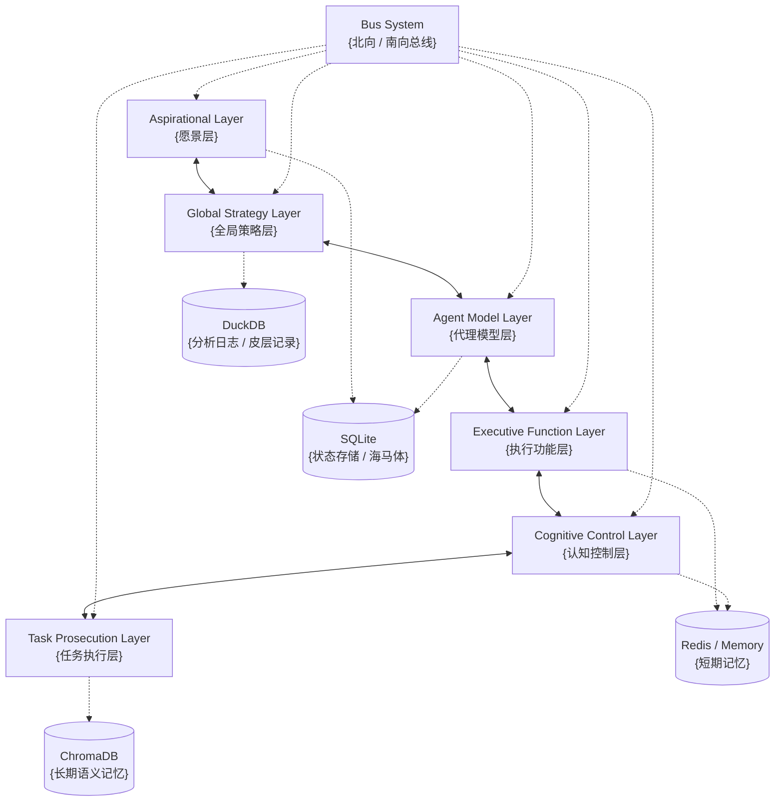

# ACE Engine Core

[](https://www.typescriptlang.org/)
[](https://nodejs.org/)
[](./LICENSE)

**ACE (Agentic Context Engineering) Engine Core** 是一个严格遵循 [Autonomous Cognitive Entity (ACE)](https://github.com/daveshap/ACE_Framework) 框架定义的 Node.js SDK。它旨在为开发者提供一个生产级可用的、具备“认知优先”架构的通用人工智能代理引擎。

## 🌟 核心特性

- **认知优先 (Cognition-First)**: 独立于 I/O 的认知调度器 (`CognitiveScheduler`)，驱动代理主动思考与反思 (Heartbeat & Reflection Cycle)。
- **六层架构 (Six-Layer Architecture)**: 严格实现 ACE 论文定义的六个层级，包含道德仲裁 (Ethical Adjudicator)、挫折状态机 (Frustration State Machine) 等核心组件。
- **双向总线 (Bidirectional Bus)**: 基于 `EventEmitter` 的双向总线，内置 `SecurityOverlay` 实现指令拦截与数据脱敏。
- **复合存储 (Composite Storage)**:
    - **SQLite**: 事务性状态存储 (WAL 模式)。
    - **DuckDB**: 零拷贝分析型日志存储。
    - **ChromaDB**: 语义化长期记忆 (情节与知识)。
    - **Redis/Memory**: 上下文窗口自动向量化 (Auto-Vectorization) 至长期记忆。
- **类型安全**: 全面使用 TypeScript 编写，集成 Zod 进行运行时 Schema 校验。

## 📦 依赖版本管理策略

本项目使用语义化版本控制 (SemVer) 管理依赖。为确保稳定性和兼容性：

- **生产环境**: 使用 `^` (caret) 前缀，允许小版本和补丁版本更新
- **兼容性保证**: 主版本号 (major) 变化表示不兼容的 API 变更
- **锁定文件**: `package-lock.json` 提供精确的依赖版本锁定，确保可重复构建
- **版本范围**: 依赖版本范围遵循以下原则：
    - `^11.7.0`: 允许 `>=11.7.0 <12.0.0` 的版本更新
    - 只接受向后兼容的更新 (minor 和 patch 版本)
    - 主版本号变更需要手动审查和测试

**建议**:
- 在生产环境中定期运行 `npm audit` 检查安全漏洞
- 升级依赖前运行完整测试套件
- 对于关键依赖，考虑固定版本号 (移除 `^` 前缀) 以确保完全一致

## 🏗️ 系统架构



## 📦 技术栈

- **Runtime**: Node.js 18+ (TypeScript)
- **Vector Store**: ChromaDB (情节与语义记忆)
- **Transaction Store**: SQLite (Better-SQLite3, WAL Mode)
- **Analytics Engine**: DuckDB (DuckDB-Async)
- **Cache**: Redis (Production) / LRU Cache (Development)
- **Validation**: Zod

## 🚀 快速开始

### 安装

```bash
npm install ace-engine-core
```

### 基础使用

```typescript
import { AceEngine } from 'ace-engine-core';
import { OpenAIProvider } from './your-llm-provider'; // 需自行实现 BaseLLM 接口

// 1. 初始化引擎
const engine = new AceEngine({
  agentId: 'ace-001',
  
  // 存储配置
  storage: {
    mode: 'composite',
    sqlitePath: './data/state.db',
    duckdbPath: './data/logs.duckdb'
  },
  
  // 缓存配置
  cache: {
    type: 'memory', // 或 'redis'
    // redisUrl: 'redis://localhost:6379'
  },
  
  // 记忆配置
  memory: {
    provider: 'chroma',
    endpoint: 'http://localhost:8000',
    collectionPrefix: 'ace_v1'
  },
  
  // LLM 配置
  llm: {
    driver: new OpenAIProvider({ apiKey: process.env.OPENAI_API_KEY }),
    modelMap: {
      'aspirational': 'gpt-4',
      'task_prosecution': 'gpt-3.5-turbo'
    }
  }
});

// 2. 注册工具
engine.registerTool({
  name: 'web_search',
  description: 'Search the internet for information',
  schema: z.object({ query: z.string() }),
  execute: async ({ query }) => {
    // ... implementation
    return `Results for ${query}`;
  }
});

// 3. 启动引擎
await engine.start();

// 4. 注入初始指令 (通常通过 Aspirational Layer 或外部 API)
// engine.bus.publishSouthbound(...)

// 5. 关闭
// await engine.stop();
```

## 📁 项目结构

```
ace-engine-core/
├── src/
│   ├── index.ts              # 主导出
│   ├── ace_engine.ts         # 引擎入口类
│   ├── types/                # 类型定义
│   ├── core/
│   │   └── bus.ts            # 总线系统
│   ├── layers/               # 六层架构实现
│   │   ├── aspirational.ts
│   │   ├── global_strategy.ts
│   │   ├── agent_model.ts
│   │   ├── executive_function.ts
│   │   ├── cognitive_control.ts
│   │   └── task_prosecution.ts
│   ├── storage/              # 复合存储实现
│   │   ├── sqlite.ts
│   │   ├── duckdb.ts
│   │   ├── chroma.ts
│   │   └── memory.ts
│   └── utils/
├── tests/                    # 测试文件
└── package.json
```

## 📝 许可证

MIT License - 详见 [LICENSE](./LICENSE) 文件

## 📚 相关资源

- [ACE 终极详细设计](./ACE终极详细设计.md)
- [ACE Framework (David Shapiro)](https://github.com/daveshap/ACE_Framework)
