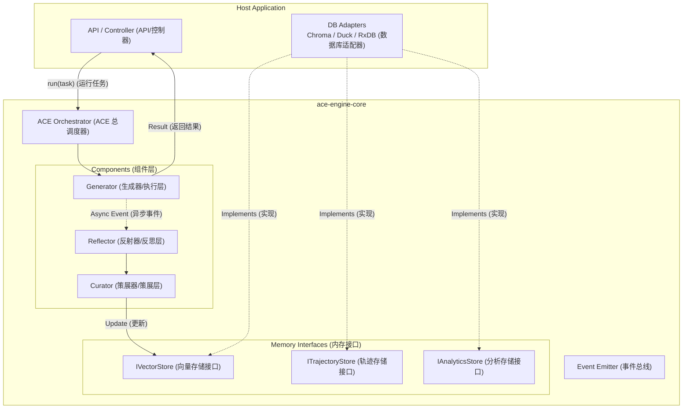

这是一份为您量身定制的 **ACE (Agentic Context Engineering) Node.js SDK 设计方案**。

这份方案将围绕您的核心技术栈（Node.js, ChromaDB, DuckDB, PouchDB/RxDB）构建，重点在于**模块化（Modularity）和接口抽象（Abstraction）**，确保核心逻辑封装在 SDK 中，而具体的数据库实现可以灵活注入。

-----

# 项目名称：`ace-engine-core` 设计方案

## 一、 设计目标

1.  **封装性：** 将 ACE 的 Generator、Reflector、Curator 三层逻辑封装为黑盒。
2.  **插件化：** 存储层（Vector, Logs, Trajectory）通过接口（Interface）注入，不硬编码具体数据库驱动。
3.  **异步事件驱动：** 利用 Node.js 特性，实现“主任务同步返回，进化任务后台运行”。

-----

## 二、 系统架构图



-----

## 三、 核心数据结构 (TypeScript Interfaces)

在 SDK 的 `src/types.ts` 中定义核心数据标准。

```typescript
// 1. 战术手册中的单条规则 (The Atom of Memory)
export interface Rule {
  id: string;           // UUID
  content: string;      // 规则文本
  embedding?: number[]; // 向量数据 (可选，由 DB 处理)
  metadata: {
    created_at: number;
    last_used: number;
    success_count: number; // 成功次数
    failure_count: number; // 失败次数
    source_task_id?: string; // 来源任务 ID
  };
}

// 2. 增量更新包 (The Git Commit)
export interface Delta {
  type: 'ADD' | 'UPDATE' | 'DELETE';
  rule_id?: string;
  content?: string;      // 如果是 ADD/UPDATE
  reasoning: string;     // Reflector 的原始反思文本
}

// 3. 完整轨迹 (The Raw Experience)
export interface Trajectory {
  task_id: string;
  user_input: string;
  steps: Array<{
    thought: string;
    action: string;
    output: string;
  }>;
  final_result: string;
  environment_feedback: string; // 报错信息或用户反馈
  timestamp: number;
}
```

-----

## 四、 存储适配器接口 (Adapter Pattern)

这是 SDK 最关键的部分。SDK 只调用这些接口，**不包含 `chromadb` 或 `duckdb` 的 npm 包**。

```typescript
// src/interfaces/store.ts

// 向量存储接口 (对应 ChromaDB)
export interface IVectorStore {
  search(query: string, limit: number): Promise<Rule[]>;
  add(rules: Rule[]): Promise<void>;
  updateMetadata(id: string, metadata: Partial<Rule['metadata']>): Promise<void>;
  delete(ids: string[]): Promise<void>;
}

// 轨迹存储接口 (对应 RxDB / PouchDB)
export interface ITrajectoryStore {
  saveTrajectory(traj: Trajectory): Promise<void>;
  getTrajectory(id: string): Promise<Trajectory | null>;
}

// 分析存储接口 (对应 DuckDB)
export interface IAnalyticsStore {
  logEvent(event: { type: string; payload: any; timestamp: number }): Promise<void>;
  // DuckDB 的复杂查询通常在 Host App 做，SDK 负责写入日志流
}
```

-----

## 五、 SDK 核心模块设计

### 1\. 主入口 `AceAgent`

```typescript
import { EventEmitter } from 'events';

export class AceAgent extends EventEmitter {
  private generator: Generator;
  private reflector: Reflector;
  private curator: Curator;

  constructor(config: {
    llm: BaseLLM;             // 传入 LangChain 或其他 LLM 实例
    vectorStore: IVectorStore;
    trajectoryStore: ITrajectoryStore;
    analyticsStore?: IAnalyticsStore;
  }) {
    super();
    // 初始化子组件
    this.generator = new Generator(config.llm, config.vectorStore);
    this.reflector = new Reflector(config.llm);
    this.curator = new Curator(config.llm, config.vectorStore);
  }

  /**
   * 核心运行方法
   */
  async run(task: string): Promise<string> {
    // 1. 检索相关规则 (Playbook Retrieval)
    const context = await this.generator.retrieveContext(task);
    
    // 2. 执行任务 (Generation)
    const { result, trajectory } = await this.generator.execute(task, context);
    
    // 3. 保存原始轨迹 (Persistence)
    await this.trajectoryStore.saveTrajectory(trajectory);

    // 4. 触发异步进化 (Fire and Forget)
    this.evolve(trajectory).catch(err => this.emit('error', err));

    return result;
  }

  /**
   * 后台进化逻辑 (The Evolution Loop)
   */
  private async evolve(traj: Trajectory) {
    this.emit('status', 'reflecting');
    
    // 1. 反思 (Reflection)
    const insights = await this.reflector.analyze(traj);
    
    // 2. 策展 (Curation)
    this.emit('status', 'curating');
    const deltas = await this.curator.processInsights(insights, traj.task_id);
    
    // 3. 应用更新 (Update)
    if (deltas.length > 0) {
      await this.curator.applyDeltas(deltas);
      
      // 记录日志到 DuckDB 接口
      if (this.analyticsStore) {
         await this.analyticsStore.logEvent({ type: 'PLAYBOOK_UPDATE', payload: deltas, timestamp: Date.now() });
      }
      
      this.emit('evolved', deltas);
    }
  }
}
```

-----

## 六、 Host App (业务工程) 接入示例

这是在您的 Node.js 服务器代码中如何使用上面写好的 SDK。

### 1\. 实现适配器 (`src/adapters/`)

**ChromaAdapter.ts:**

```typescript
import { ChromaClient } from 'chromadb';
import { IVectorStore, Rule } from 'ace-engine-core';

export class ChromaAdapter implements IVectorStore {
  private collection: any;
  constructor(private client: ChromaClient) {}
  
  async init() {
    this.collection = await this.client.getOrCreateCollection({ name: "ace_rules" });
  }

  async search(query: string, limit: number): Promise<Rule[]> {
    const results = await this.collection.query({ queryTexts: [query], nResults: limit });
    // 转换 Chroma 格式到 SDK Rule 格式...
    return mapToRules(results);
  }
  
  // ... 实现 add, update, delete
}
```

**DuckDBAdapter.ts:**

```typescript
import { Database } from 'duckdb-async';
import { IAnalyticsStore } from 'ace-engine-core';

export class DuckDBAdapter implements IAnalyticsStore {
  constructor(private db: Database) {}
  
  async logEvent(event: any) {
    await this.db.run(
      `INSERT INTO ace_logs (type, payload, timestamp) VALUES (?, ?, ?)`, 
      [event.type, JSON.stringify(event.payload), event.timestamp]
    );
  }
}
```

### 2\. 业务代码调用

```typescript
// app.ts
import { AceAgent } from 'ace-engine-core';
import { ChromaAdapter } from './adapters/ChromaAdapter';
import { RxDBAdapter } from './adapters/RxDBAdapter';
import { DuckDBAdapter } from './adapters/DuckDBAdapter';
import { ChatOpenAI } from '@langchain/openai';

async function main() {
  // 1. 准备基础设施
  const chroma = new ChromaAdapter(...);
  const rxdb = new RxDBAdapter(...);
  const duckdb = new DuckDBAdapter(...);
  const llm = new ChatOpenAI({ modelName: 'gpt-4' });

  // 2. 初始化 SDK
  const agent = new AceAgent({
    llm,
    vectorStore: chroma,
    trajectoryStore: rxdb,
    analyticsStore: duckdb
  });

  // 3. 监听进化事件
  agent.on('evolved', (deltas) => {
    console.log('🚀 Agent 进化了! 更新了规则:', deltas);
  });

  // 4. 执行任务
  const response = await agent.run("帮我写一个 Python 脚本查询天气");
  console.log("Agent 回复:", response);
  
  // 此时，后台正在进行 Reflection 和 Curation，几秒后会触发 'evolved' 事件
}
```

-----

## 七、 目录结构规划 (SDK 仓库)

```text
ace-engine-core/
├── package.json
├── tsconfig.json
├── src/
│   ├── index.ts             # 导出 AceAgent, Interfaces
│   ├── agent.ts             # AceAgent 主类
│   ├── types.ts             # 数据类型定义
│   ├── interfaces/
│   │   └── store.ts         # 存储适配器接口定义
│   ├── core/
│   │   ├── generator.ts     # 生成器逻辑
│   │   ├── reflector.ts     # 反思器逻辑
│   │   └── curator.ts       # 策展人逻辑
│   └── utils/
│       ├── prompt-templates.ts  # 内置 Prompt 模板
│       └── token-counter.ts
```

-----

## 八、 开发路线图建议

1.  **Phase 1: 骨架搭建**

      * 定义 `types.ts` 和 `interfaces/store.ts`。
      * 编写 `AceAgent` 的空壳类。
      * 实现一个简单的 `InMemoryVectorStore` (内存数组) 用于单元测试。

2.  **Phase 2: 核心组件实现**

      * 实现 `Generator`：跑通 Prompt + Context -\> LLM 的流程。
      * 实现 `Reflector`：编写 prompt template，提取 insights。

3.  **Phase 3: Curator 与持久化**

      * 实现 `Curator` 的去重逻辑（比较 embedding 相似度）。
      * 在宿主工程中实现 `ChromaAdapter` 并联调。

4.  **Phase 4: 异步与事件**

      * 完善 `EventEmitter`。
      * 对接 `DuckDB` 和 `RxDB` 适配器。

这个设计方案保证了您的代码库整洁、可维护，并且充分利用了 Node.js 生态的优势。您可以直接按照此结构开始初始化 npm 项目。