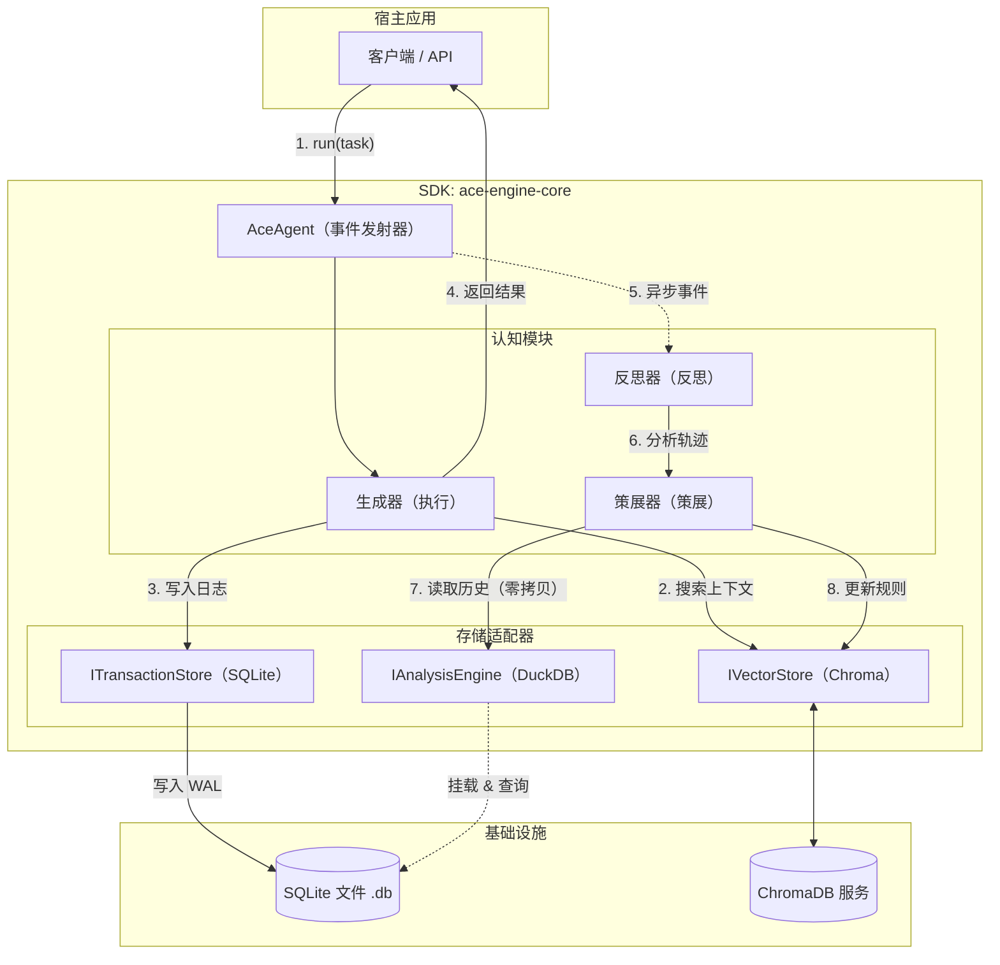

这是一个**最终版、生产级**的 ACE 框架 SDK 详细设计方案。

本方案严格基于 **Node.js** 环境，采用 **ChromaDB (向量记忆)** + **SQLite (事务日志)** + **DuckDB (挂载分析)** 的“黄金三角”架构。此设计旨在实现高性能的写入、低延迟的检索以及强大的离线分析能力。

-----

# 项目代号：`ace-engine-core` 最终架构设计文档

## 1\. 总体架构概览 (System Architecture)

### 1.1 设计哲学

  * **SDK 化：** 核心逻辑封装为 npm 包，宿主应用（Host App）通过实例化 Agent 来使用。
  * **读写分离 (CQRS 变体)：**
      * **快路径 (Hot Path):** Generator 执行任务，只读 Chroma，只写 SQLite（毫秒级）。
      * **慢路径 (Cold Path):** Reflector/Curator 后台异步运行，利用 DuckDB 分析 SQLite 数据，更新 Chroma。
  * **零拷贝分析：** DuckDB 不持有数据，直接挂载 SQLite 的 `.db` 文件进行 OLAP 分析。

### 1.2 架构图



-----

## 2\. 数据层详细设计 (Data Schema)

这是系统的基石。

### 2.1 向量存储 (ChromaDB)

**Collection Name:** `ace_playbook`
**用途:** 存储当前的“战术手册” (Rules)。

| Field       | Type          | Description                                        |
| :---------- | :------------ | :------------------------------------------------- |
| `id`        | String (UUID) | 规则唯一标识                                       |
| `document`  | String        | **规则内容** (例如："使用 fetch 时必须加超时设置") |
| `embedding` | Vector        | 内容的向量表示 (由 Chroma 自动或 SDK 手动生成)     |
| `metadata`  | Map           | 统计数据与元数据                                   |

**Metadata 字段详情:**

  * `success_count` (int): 帮助成功的次数
  * `failure_count` (int): 导致失败的次数
  * `created_at` (timestamp)
  * `last_used_at` (timestamp)
  * `source_task_id` (string): 来源任务 ID

### 2.2 事务存储 (SQLite)

**File:** `ace_events.db` (开启 WAL 模式)
**用途:** 记录所有原始数据，作为 Single Source of Truth。

**Table 1: `trajectories` (任务轨迹)**

```sql
CREATE TABLE trajectories (
    id TEXT PRIMARY KEY,          -- UUID
    task_input TEXT,              -- 用户原始输入
    content JSON,                 -- 完整轨迹对象 (包含 CoT, ToolCalls)
    outcome TEXT,                 -- 'SUCCESS' | 'FAILURE'
    used_rule_ids JSON,           -- 本次任务引用的规则 ID 列表 (用于后续关联分析)
    timestamp INTEGER,            -- Unix 时间戳
    duration_ms INTEGER           -- 耗时
);
CREATE INDEX idx_traj_time ON trajectories(timestamp);
```

**Table 2: `delta_logs` (进化日志)**

```sql
CREATE TABLE delta_logs (
    id INTEGER PRIMARY KEY AUTOINCREMENT,
    rule_id TEXT,                 -- 关联的规则 ID
    action_type TEXT,             -- 'ADD', 'UPDATE', 'DELETE', 'MERGE'
    reasoning TEXT,               -- Reflector 的原始反思文本
    change_payload JSON,          -- 具体改了什么 (Diff)
    triggered_by_task_id TEXT,    -- 触发此更新的任务 ID
    timestamp INTEGER
);
```

### 2.3 分析层 (DuckDB)

**模式:** 内存模式 (`:memory:`) + 挂载
**操作:** 不创建物理表，启动时执行 `INSTALL sqlite; LOAD sqlite; CALL sqlite_attach('ace_events.db', alias='storage');`。
**查询示例:** 直接查询 `storage.trajectories`。

-----

## 3\. 核心模块详细设计 (Module Specifications)

### 3.1 `IVectorStore` 接口 & `ChromaAdapter`

为了解耦，必须定义接口。

```typescript
export interface Rule {
  id: string;
  content: string;
  metadata: {
    success_count: number;
    failure_count: number;
    last_used_at: number;
    [key: string]: any;
  };
  score?: number; // 搜索时的相似度
}

export interface IVectorStore {
  search(query: string, limit: number): Promise<Rule[]>;
  add(rules: Omit<Rule, 'score'>[]): Promise<void>;
  update(id: string, content?: string, metadata?: Partial<Rule['metadata']>): Promise<void>;
  delete(ids: string[]): Promise<void>;
}
```

### 3.2 `ITransactionStore` 接口 & `SQLiteAdapter`

利用 `better-sqlite3` 的同步特性，保证极高的写入吞吐量。

```typescript
export interface ITransactionStore {
  init(): void; // 建表
  saveTrajectory(traj: Trajectory): void; // 注意：这里可以是 void 因为是同步写入
  logDelta(delta: DeltaLog): void;
  getDbPath(): string; // 返回 .db 文件绝对路径
}
```

### 3.3 `Generator` (执行器)

**逻辑流程:**

1.  **Retrieve:** 根据 User Query，调用 `IVectorStore.search()` 获取 Top-5 规则。
2.  **Prompt Assembly:**
      * System Prompt: 包含 "You represent the company's best practices..."
      * Context Block: 将 5 条规则格式化为 Markdown List。
      * Task: 用户输入。
3.  **Execution:** 调用 LLM。
      * *关键点:* 强制 LLM 在 Chain-of-Thought 中显式引用规则 ID (例如 `(Ref: rule_8a2b)` )。
4.  **Record:** 解析 LLM 输出，提取 result 和 tool calls，构建 `Trajectory` 对象。
5.  **Persist:** 调用 `ITransactionStore.saveTrajectory()`。

### 3.4 `Reflector` (反思器)

**触发:** 监听 `Generator` 完成事件。
**Prompt 策略:**

  * 输入: 用户的任务 + Generator 的完整轨迹 + 最终结果 (Success/Fail)。
  * 目标: 输出 JSON。

<!-- end list -->

```json
{
  "outcome_analysis": "The task failed because the library version was outdated.",
  "blame_assignment": {
    "type": "missing_knowledge", // or 'bad_rule', 'hallucination'
    "culprit_rule_id": null,     // 如果是旧规则误导，填 ID
    "new_insight": "Always check package.json version before installing."
  }
}
```

### 3.5 `Curator` (策展人) - **最核心的复杂逻辑**

**触发:** `Reflector` 完成后。
**逻辑流程:**

1.  **输入:** Reflector 产出的 `new_insight`。
2.  **Check Novelty (使用 DuckDB + Vector):**
      * 先查 `IVectorStore` 找相似规则。
      * *高级特性:* 还可以通过 `IAnalysisEngine` (DuckDB) 查询历史，看类似问题是否在过去 24 小时频繁出现（防止抖动）。
3.  **Decision Making (LLM):**
      * Prompt: "这里有一条新教训和 3 条现有相似规则。请决定：(A) 忽略，(B) 更新现有规则的计数器，(C) 修改现有规则内容，(D) 新增规则。"
4.  **Execute Update:**
      * 更新 ChromaDB (通过 `IVectorStore`)。
      * 记录变更到 SQLite (通过 `ITransactionStore.logDelta`)。

-----

## 4\. 详细交互序列 (Sequence Diagram)

```typescript
// 伪代码描述的交互流

// 1. Host App 初始化
const store = new SQLiteAdapter('./data.db');
const memory = new ChromaAdapter(client, 'playbook');
const analysis = new DuckDBAdapter();
await analysis.connect(store.getDbPath()); // 挂载

const agent = new AceAgent({ store, memory, analysis, llm });

// 2. 运行时 (Runtime)
agent.run("Fix bug #101").then(result => {
    console.log("User got response"); // 用户无感知延迟
});

// 3. SDK 内部 (Inside SDK)
// Generator 完成 -> emit('trajectory_created', traj)

// 4. 异步进化循环 (Event Loop)
agent.on('trajectory_created', async (traj) => {
    // Step A: Reflect
    const insight = await reflector.analyze(traj);
    
    // Step B: Curate
    // 使用 DuckDB 检查这条规则最近的表现
    const history = await analysis.query(
        `SELECT outcome FROM storage.trajectories 
         WHERE json_extract(content, '$.task_input') LIKE ? 
         LIMIT 10`, 
        [`%${topic}%`]
    );
    
    const deltas = await curator.plan(insight, history);
    
    // Step C: Apply
    await memory.update(deltas);
    store.logDelta(deltas);
    
    agent.emit('evolved', deltas);
});
```

-----

## 5\. 工程目录结构推荐

```text
ace-engine-core/
├── src/
│   ├── index.ts                  # 统一导出
│   ├── agent.ts                  # AceAgent 主类 (Orchestrator)
│   ├── types.ts                  # Rule, Trajectory, Delta 定义
│   ├── interfaces/
│   │   ├── store.ts              # IVectorStore, ITransactionStore
│   │   └── analysis.ts           # IAnalysisEngine
│   ├── core/
│   │   ├── generator.ts
│   │   ├── reflector.ts
│   │   └── curator.ts
│   ├── adapters/
│   │   ├── sqlite-adapter.ts     # better-sqlite3 实现
│   │   └── duckdb-adapter.ts     # duckdb-async 挂载实现
│   └── utils/
│       └── prompts.ts            # 核心 System Prompts
├── tests/
├── package.json
└── tsconfig.json
```

-----

## 6\. 关键技术难点与解决方案

### 6.1 并发锁问题 (The Locking Issue)

  * **问题:** 当 SQLite 处于 WAL 模式且正在高频写入时，DuckDB 尝试挂载可能会遇到锁冲突。
  * **解决:** 在 DuckDB 挂载时，必须指定 `read_only=true`。
    ```sql
    CALL sqlite_attach('path/to/db', alias='storage', read_only=true);
    ```
    且 `better-sqlite3` 连接时务必开启 WAL (`db.pragma('journal_mode = WAL')`)。WAL 模式允许多个 reader 和一个 writer 并存。

### 6.2 上下文污染 (Context Pollution)

  * **问题:** Playbook 变得无限大，包含垃圾规则。
  * **解决:** Curator 必须实现\*\*“遗忘机制”\*\*。
      * 定期任务 (Cron): 每天运行一次 DuckDB 查询：
        ```sql
        -- 找出最近 30 天使用次数为 0 的规则
        SELECT rule_id FROM delta_logs 
        GROUP BY rule_id 
        HAVING MAX(timestamp) < (NOW - 30days)
        ```
      * 将这些 ID 传给 `IVectorStore.delete()`。

### 6.3 令牌消耗 (Cost Control)

  * **问题:** Reflector/Curator 每一轮都跑，Token 消耗是 Generator 的 2 倍。
  * **解决:** 引入 **"Sampling Strategy" (采样策略)**。
      * 只对 **失败 (Failure)** 的任务进行 Reflection。
      * 或者对成功任务进行 10% 的随机抽样。
      * 在 `AceAgent` 配置中增加 `reflection_rate: 0.1 | 'on_failure' | 'always'`。

-----

这份设计文档提供了一个可落地、高性能且架构清晰的 ACE SDK 蓝图。您可以直接交给开发团队（或作为自己的开发指南）进行编码。